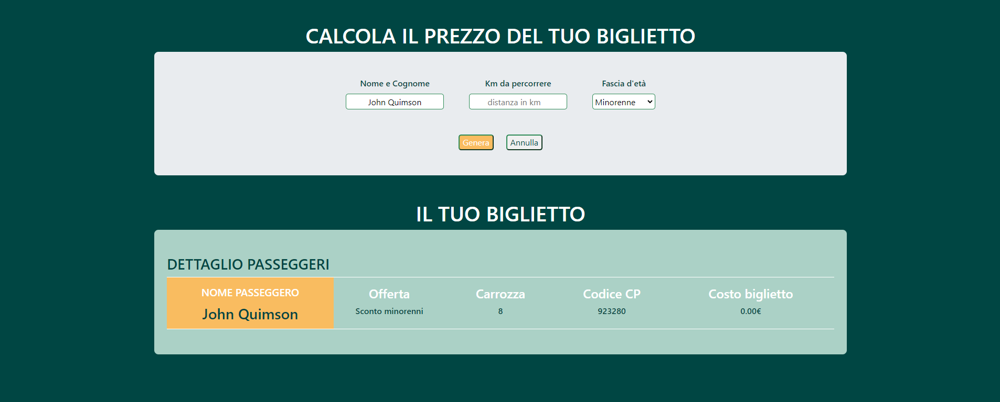

# Calcolatore prezzo Treno

### Programma che calcola il prezzo del biglietto di un treno, in base a diversi fattori:

- Il numero di chilometri da percorrere
- Età del passeggero
- va applicato uno sconto del 20% per i minorenni
- va applicato uno sconto del 40% per gli over 65.

1. Input e bottone con richiesta informazioni (km e età)
2. Prezzo, in base ai km
3. Condizioni (minorenne / over 65)
4. Output formattato in maniera umana su console
5. Stampare in pagina i dati

